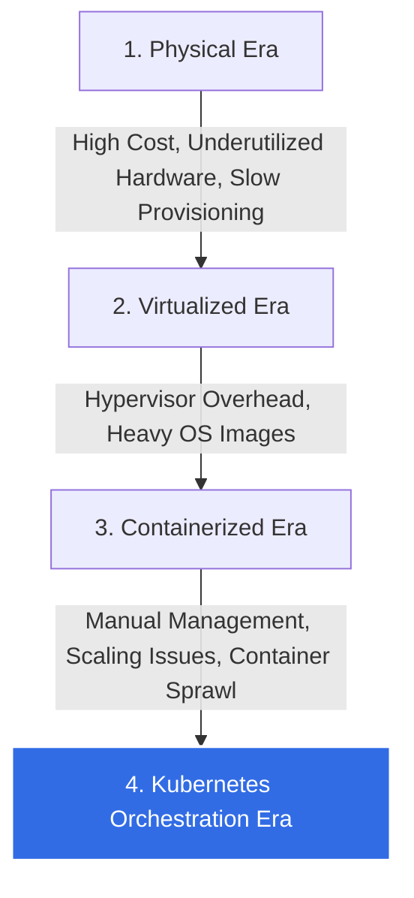
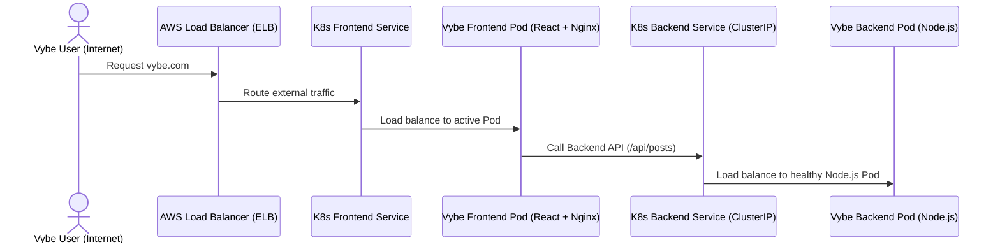

# ☸️ The Kubernetes Handbook: For Vybe & DevOps Mastery

Welcome to your comprehensive, visual, and highly concise guide to **Kubernetes (K8s)**. This guide is tailored to help you understand *why* Kubernetes exists, the real-world problems it solves, and how it directly applies to orchestrating your **Vybe Social Media Platform** on AWS EKS.

---

## 1. What Problem Does Kubernetes Solve?

### The Evolution: Why K8s Exists
Before Kubernetes, deploying applications went through three main eras:



1. **Physical Servers:** One app per server. High costs, slow setup, wasted hardware resources.
2. **Virtual Machines (VMs):** Multiple apps on one physical machine, isolated by Hypervisors. Better, but each VM carries the overhead of a full Operating System.
3. **Containers (Docker):** Apps share the host OS kernel. Extremely lightweight, fast starting, and portable.
4. **Orchestration (Kubernetes):** If you run 2 containers, Docker is enough. But if you have **hundreds** of containers across a cluster of servers, how do you handle:
   - **Self-Healing:** What if a container crashes? Who restarts it?
   - **Auto-Scaling:** What if traffic to Vybe spikes? Who spins up new containers?
   - **Service Discovery & Load Balancing:** How do containers talk to each other and share traffic?
   - **Zero-Downtime Rollouts:** How do you deploy updates without stopping the app?

**Kubernetes is the "Operating System" for your container cluster.** It manages these tasks automatically.

---

## 2. Kubernetes Core Architecture

Kubernetes separates your infrastructure into a **Control Plane** (the brains) and **Worker Nodes** (the muscle).

```mermaid
graph GD
    subgraph Control Plane [Control Plane (Master Node)]
        API[API Server: The Front Entrypoint]
        ETCD[(etcd: Key-Value Database of State)]
        SCHED[Scheduler: Decides where Pods run]
        CCM[Controller Manager: Maintains desired state]
    end

    subgraph Node1 [Worker Node 1]
        Kubelet1[kubelet: Node Agent]
        Proxy1[kube-proxy: Network Routing]
        Pod1[Pod: Vybe Frontend]
        Pod2[Pod: Vybe Backend]
    end

    subgraph Node2 [Worker Node 2]
        Kubelet2[kubelet]
        Proxy2[kube-proxy]
        Pod3[Pod: Vybe Backend]
    end

    API <--> ETCD
    API <--> SCHED
    API <--> CCM
    API <--> Kubelet1
    API <--> Kubelet2
    style Control Plane fill:#f5f5f5,stroke:#326ce5,stroke-width:2px
    style Node1 fill:#e6f2ff,stroke:#0059b3,stroke-width:1px
    style Node2 fill:#e6f2ff,stroke:#0059b3,stroke-width:1px
```

---

## 3. The 5 Essential Lessons of Kubernetes

### 📘 Lesson 1: Pods (The Atomic Unit)
* **What is it?** A Pod is the smallest deployable unit in Kubernetes. It represents a single running process and wraps one or more closely related containers (usually one container per Pod).
* **Real-World Vybe Use Case:** You will run your Node.js backend container inside a `Vybe-Backend` Pod, and your React+Nginx container in a `Vybe-Frontend` Pod.
* **Key Spec Example:**
```yaml
apiVersion: v1
kind: Pod
metadata:
  name: vybe-backend-pod
  labels:
    app: vybe-backend
spec:
  containers:
  - name: backend
    image: satishraut/vybe-backend:v1
    ports:
    - containerPort: 5000
```

---

### 📘 Lesson 2: Deployments (Replication & Self-Healing)
* **What is it?** You rarely create individual Pods directly. Instead, you use a **Deployment**. It defines the *desired state* (e.g., "I want always 3 replicas of the Vybe Backend running") and automatically keeps them running.
* **Why it matters:** If a Node crashes and a Pod dies, the Deployment controller instantly notices and schedules a new Pod on a healthy Node.
* **Key Spec Example:**
```yaml
apiVersion: apps/v1
kind: Deployment
metadata:
  name: vybe-backend-deployment
spec:
  replicas: 3 # Tells K8s to keep exactly 3 copies running
  selector:
    matchLabels:
      app: vybe-backend
  template:
    metadata:
      labels:
        app: vybe-backend
    spec:
      containers:
      - name: backend
        image: satishraut/vybe-backend:v1
        ports:
        - containerPort: 5000
```

---

### 📘 Lesson 3: Services (Networking & Load Balancing)
* **What is it?** Pods are dynamic and ephemeral—they die and get recreated with *new IP addresses*. A **Service** provides a stable, permanent IP address and DNS name to route traffic to a group of Pods.
* **Types of Services:**
  1. **ClusterIP (Default):** Accessible only *inside* the cluster (e.g., Vybe Frontend talking to Backend).
  2. **NodePort:** Exposes the service on a static port on each Node's IP.
  3. **LoadBalancer:** Provisions an external cloud load balancer (like AWS ALB/ELB) to route public internet traffic to your Pods.
* **Key Spec Example:**
```yaml
apiVersion: v1
kind: Service
metadata:
  name: vybe-backend-service
spec:
  type: ClusterIP # Internal communication
  ports:
  - port: 5000
    targetPort: 5000
  selector:
    app: vybe-backend # Directs traffic to pods with this label
```

---

### 📘 Lesson 4: ConfigMaps & Secrets (Decoupling Configuration)
* **What is it?** Never hardcode environment variables or database URLs inside Docker images.
  - **ConfigMap:** Stores non-confidential configuration (e.g., API URLs, port numbers).
  - **Secret:** Stores sensitive information encoded in base64 (e.g., MongoDB URI, AWS SQS/S3 keys, Clerk secret keys).
* **Key Spec Example:**
```yaml
apiVersion: v1
kind: Secret
metadata:
  name: vybe-secrets
type: Opaque
data:
  MONGO_URI: bW9uZ29kYitzc2g6Ly91c2VyOnBhc3N3b3Jk... # Base64 encoded connection string
```

---

### 📘 Lesson 5: Horizontal Pod Autoscaler (HPA)
* **What is it?** Automatically scales the number of Pods in a Deployment based on metrics like CPU utilization or memory usage.
* **Real-World Vybe Use Case:** If a popular post on Vybe goes viral and traffic surges, HPA notices CPU usage crossing 70% and spins up more Backend Pods (from 2 to 10). When traffic subsides, it scales them back down to save cost!
* **Key Spec Example:**
```yaml
apiVersion: autoscaling/v1
kind: HorizontalPodAutoscaler
metadata:
  name: vybe-backend-hpa
spec:
  scaleTargetRef:
    apiVersion: apps/v1
    kind: Deployment
    name: vybe-backend-deployment
  minReplicas: 2
  maxReplicas: 10
  targetCPUUtilizationPercentage: 70
```

---

## 4. Summary: How It All Fits Together for Vybe

When you deploy Vybe on AWS EKS (Elastic Kubernetes Service), this is what the request flow looks like:



### Next Steps for Your DevOps Assignment
1. **Containerize:** Build Docker images for both `/frontend` and `/backend`.
2. **Deploy on EKS:** Write your YAML files (Deployment, Service, Secrets, ConfigMaps) and apply them using `kubectl apply -f <filename>.yaml`.
3. **Automate:** Integrate this step into your Jenkins CI/CD pipeline so every git push to the main branch automatically builds the Docker image, pushes it to AWS ECR, and updates the EKS Deployment!
